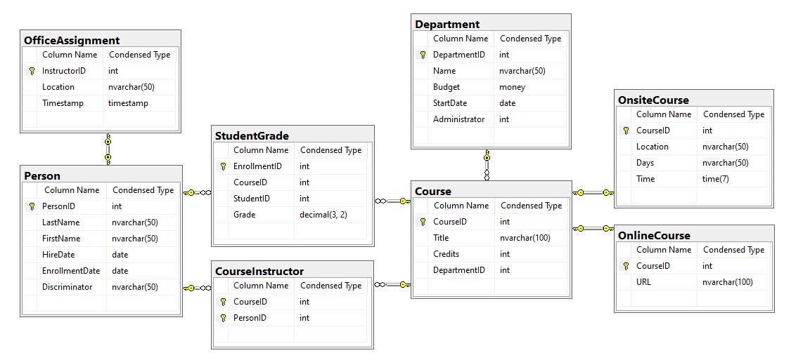

# WebAPI_ASPNET_SQL
The project to build Web API for Call em All Coding challenge

@ Task on August 21, 2020 ~ August 23, 2020

<a href="#Description">1. Description</a>

<a href="#Environment">2. Environment</a>

<a href="#Database-and-Models">3. Database and Models</a>

<a href="#Test-Tool">4. Test Tool </a>

<a href="#Challenge-1">5. Challenge 1</a>

<a href="#Challenge-2">6. Challenge 2</a>

<a href="#Challenge-3">7. Challenge 3</a>
 
<a href="#Challenge-4">8. Challenge 4</a>

<a href="#Postman-Collections-Test">9. Postman Collections Test</a>

Description
----
 
This API is to create ASP.NET Web API using SQL server database. 

Accoring to HTTP request such as GET and POST, the endpoint return the appropriate HTTP status code and the JSON data. 

The first two challenges are related to GET request to retrive Student Grades and the finally calculated GPA. Next task is to add a student grade with the valid data.  

Environment 
----

- Visual Studio 2017 

- .NET Framework 4.8

- SQL Server 2017

Database and Models
----

SCHOOL database schema shown below and the test data are provided.
 

After creating database to SQL Server, added ADO.NET Entity Data Model to the project.

Connection String is named SchoolDBContext. (Web.config)

Generated Models for all data entities is shown below.

Test Tool
----

To run the API, installed Postman.

https://www.postman.com/

Solution Code Files and Directories
----

Most of API controller files are in the Controllers directory.

All Models of data context are in the Models directory and these are all auto-geralated.

As a data transfer object, used additional data entities. These are in the Entities directory.

Special GPA calculator module is in the Libraries directory.

 Challenge 1
 ----
 
 <b> Task </b>
 
 - HTTP Request: GET/Student/{studentId}
 
 - Response: Add an endpoint for Student information, the calculated GPA, and the grade details

 - Additional requirement:
 
	If the ID provided does not exist or is not for a student, return the appropriate HTTP status code.  
	The endpoint should return the JSON shown below.  
	Do not include NULL grades.  
	The GPA is not stored in the database, so it must be calculated. For this challenge, calculate the GPA in C# code.  

 
 <b> Solution files</b>
 
 - Controllers/StudentController.cs
 
 - Libraries/CalculateGpa.cs
 
 - Entities/Student.cs
 
 - Entities/StudentTranscript.cs
  
 - Libraries/CalculateGpa.cs
 
 <b>Postman Test Example 1 </b>
 
 - Request URL: /api/Student?studentId=2
 
 - Response Status: 200 OK
 
 
 
 <b>Postman Test Example 2   </b>
 
 - Request URL: /api/Student?studentId=4
 
 - Response Status: 404 Not Found
 
 
 
 
Challenge 2
 ----
 
 <b>Task</b>

 - HTTP Request: GET/Students
 
 - Response: Add an endpoint for all Students' information and their calculated GPA 
 
 <b>Solution files</b>
 
 - Controllers/StudentsController.cs
 
 - Libraries/CalculateGpa.cs
 
 - Entities/Student.cs
  
 - Libraries/CalculateGpa.cs
 
 <b>Postman Test Example</b>
 
 - Request URL : /api/Students
 
 - Response Status: 200 OK
 
 

 
 Challenge 4
 ----
 
 <b> Task </b>

 - HTTP Request: POST/Grades/{studentGrade}
 
 - Response: Add an endpoint for new Student grade with input data validation 

 - Additional requirements:  
	studentId must be a valid student ID.  
	courseId must be a valid course ID.  
	grade must be null or a numeric value between 0.00 and 4.00 inclusive.  
	A student may only have 1 grade per course.  

 <b> Solution files</b>
 
 - Controllers/Grades.cs  
 
 <b>Postman Test Example 1 - Data Creation Test </b>
 
 - Request URL: /api/Grades/{"StudentID":2,"CourseID":4061,"Grade":4.00}
 
 - Response Status: 201 Created
 
 
 
 <b>Postman Test Example 2 - Model Validation Error Test  </b>
 
 - Request URL: /api/Grades/{"StudentID":invalid_string_data,"CourseID":2042,"Grade":4.00}
 
 - Response Status: 400 Bad Request
 
 
 
 <b>Postman Test Example 3  - Invalid Data Test </b>
 
 - Request URL: /api/Grades/{"StudentID":1,"CourseID":2021,"Grade":4.00}
 
 - Response Status: 400 Bad Request
 
 
 
 <b>Postman Test Example 4  - Exist Data Test </b>
 
 - Request URL: /api/Grades/{"StudentID":2,"CourseID":2021,"Grade":4.00}
 
 - Response Status: 400 Bad Request
 
 

 <b>Postman Test Example 5  - Invalid Grade value Test </b>
 
 - Request URL: /api/Grades/{"StudentID":3,"CourseID":4022,"Grade":5.50}
  
 - Response Status: 400 Bad Request
 
 

  
 Postman Collections Test
 ----

 Using Tests Script, can do unit test and collections test. 

<b>Challenge 4 Status Test  </b>  
  

 <b>Postman Tests Script</b>  
 

  
